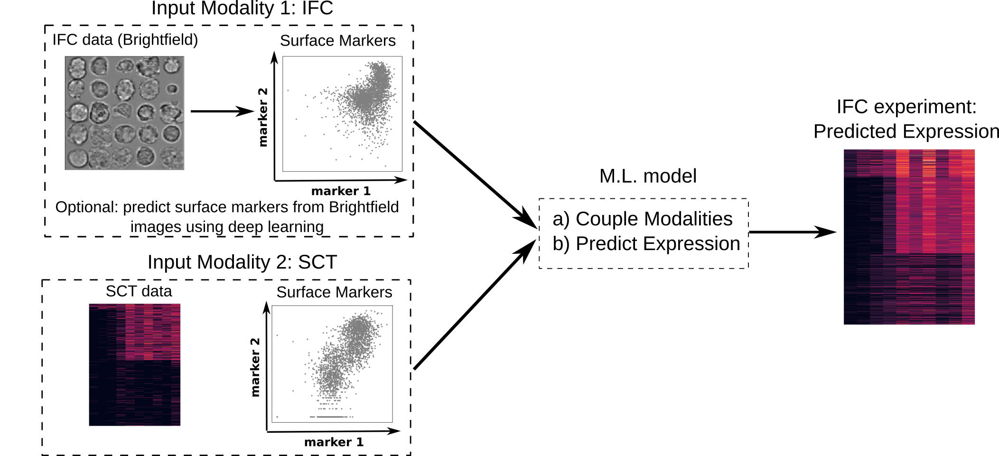

# IFC-Seq: predicting gene expression for Imaging Flow Cytometry data

**Description**

With IFC-Seq we couple two distinct modalities of single-cell data: **(1) Single Cell Transcriptomics (SCT)** and **(2) Imaging Flow Cytometry (IFC)**.  Both modalities are aligned using common surface markers (CD34 and FcgR in this example). By leveraging both views at the same time, IFC-Seq is able to predict gene expression at the single-cell level for data acquired from IFC experiments.

This is a supplementary tutorial to the methodology described in [N.K. Chlis et al., 2019](https://www.helmholtz-muenchen.de/icb/index.html). The step-by-step tutorial is presented in tutorial_ifcseq_mouse.ipynb.

**Instructions**
1. Download the notebook file: [tutorial_ifcseq_mouse.ipynb](./tutorial_ifcseq_mouse.ipynb)
2. Download the data from [here](https://hmgubox.helmholtz-muenchen.de/f/112c744ec4504dfa84f5/?dl=1)
3. Unzip data.zip into the same folder as tutorial_ifcseq_mouse.ipynb
4. Open and run the notebook

**List of materials**
1. [tutorial_ifcseq_mouse.ipynb](./tutorial_ifcseq_mouse.ipynb): The notebook presenting IFC-Seq
2. [ifcseq_data.zip](https://hmgubox.helmholtz-muenchen.de/f/112c744ec4504dfa84f5/?dl=1): the data necessary to run the notebook
